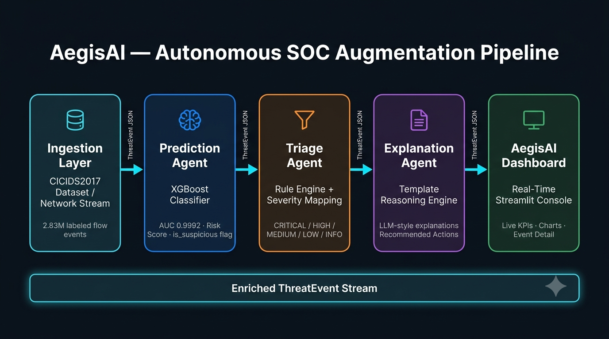

# 🛡️ AegisAI — Autonomous SOC Augmentation System

**AegisAI** is an AI-native threat detection and SOC augmentation platform that processes streaming network events, scores them for malicious behavior, triages severity, and generates analyst-grade explanations in real time.

🔴 **Live Demo:** [aegisai.online](https://aegisai.online)

---

## 🎯 What It Does

AegisAI operates as an autonomous detection, triage, and reasoning layer that feeds into SOC workflows. It ingests 2.83M real network flows from the CICIDS2017 benchmark dataset and runs each event through a multi-agent pipeline:

| Agent | Role |
|---|---|
| **Prediction Agent** | XGBoost classifier scores each event with a risk probability |
| **Triage Agent** | Rule engine assigns severity (CRITICAL → INFO) and escalation decision |
| **Explanation Agent** | Template reasoning engine generates analyst-grade narratives and action plans |

Every enriched event streams into a real-time Streamlit dashboard with KPIs, charts, live event feed, and drill-down event detail.

---

## 📊 Model Performance

| Metric | Value |
|---|---|
| Dataset | CICIDS2017 (Canadian Institute for Cybersecurity) |
| Total Rows | 2.83M labeled network flows |
| Train / Test Split | 80/20 stratified (2.26M train / 565K test) |
| Model | XGBoost with `scale_pos_weight=4.08` |
| **AUC** | **0.9992** |
| Attack Recall | 99% |
| Attack Precision | 95% |
| Accuracy | 99% |

---

## 🏗️ System Architecture



---

## 🖥️ Dashboard Pages

**Page 1 — Real-Time Console**
- Live KPIs: total events, suspicious count, critical alerts, risk index
- Severity distribution donut chart
- Attack family breakdown bar chart
- Threat trend time-series
- Live event feed

**Page 2 — Event Explorer**
- Filter by severity and attack family
- Paginated event table
- Drill-down event detail with explanation, recommended action, and reasoning trace

**Page 3 — Architecture & ML**
- System architecture diagram
- Full ML methodology (dataset, features, model selection, limitations)
- Agentic workflow breakdown
- SOC pain points and how AegisAI addresses them

---

## 🚀 Running Locally

### 1. Clone the repo
```bash
git clone https://github.com/csperera/aegis-ai.git
cd aegis-ai
```

### 2. Create virtual environment
```bash
python -m venv .venv
# Windows:
.venv\Scripts\activate
# Mac/Linux:
source .venv/bin/activate
```

### 3. Install dependencies
```bash
pip install -r requirements.txt
```

### 4. Add environment variables
Create a `.env` file in the root:

### 5. Download and preprocess the dataset
Download the CICIDS2017 MachineLearningCSV.zip from the [University of New Brunswick](https://www.unb.ca/cic/datasets/ids-2017.html), extract all CSVs into `data/raw/`, then run:
```bash
python notebooks/01_preprocess.py
python notebooks/02_train_model.py
```

### 6. Launch the dashboard
```bash
streamlit run dashboard/1_Console.py
```

The pipeline starts automatically as a background thread.

---

## 🧱 Tech Stack

| Layer | Technology |
|---|---|
| ML Model | XGBoost 2.0 |
| Data Processing | Pandas, NumPy, Scikit-learn |
| Dashboard | Streamlit, Plotly |
| Agent Pipeline | Python, custom multi-agent architecture |
| Dataset | CICIDS2017 (UNB) |
| Deployment | Render.com |

---

## 📁 Project Structure
aegis-ai/
├── backend/
│   ├── agents/
│   │   ├── prediction_agent.py   # XGBoost scoring
│   │   ├── triage_agent.py       # Rule engine + severity
│   │   └── explanation_agent.py  # Template reasoning
│   ├── core/
│   │   ├── schema.py             # ThreatEvent dataclass
│   │   └── event_store.py        # Thread-safe ring buffer
│   └── streaming_simulator.py    # Pipeline orchestration
├── dashboard/
│   ├── 1_Console.py              # Page 1: Real-time console
│   ├── pages/
│   │   ├── 2_Explorer.py         # Page 2: Event explorer
│   │   └── 3_Architecture.py     # Page 3: Architecture & ML
│   ├── components/
│   │   └── charts.py             # Plotly chart components
│   └── architecture.png          # System architecture diagram
├── models/
│   ├── xgb_model.json            # Trained XGBoost model
│   ├── scaler.pkl                # Fitted StandardScaler
│   └── feature_names.json        # Feature ordering
├── notebooks/
│   ├── 01_preprocess.py          # Data preprocessing
│   └── 02_train_model.py         # Model training
└── requirements.txt

---

## 👤 Author

**Cristian Perera**
- AI/ML Engineer
- [LinkedIn](https://linkedin.com/in/csperera)
- [GitHub](https://github.com/csperera)

---

## 📄 License

MIT License — free to use, modify, and distribute.